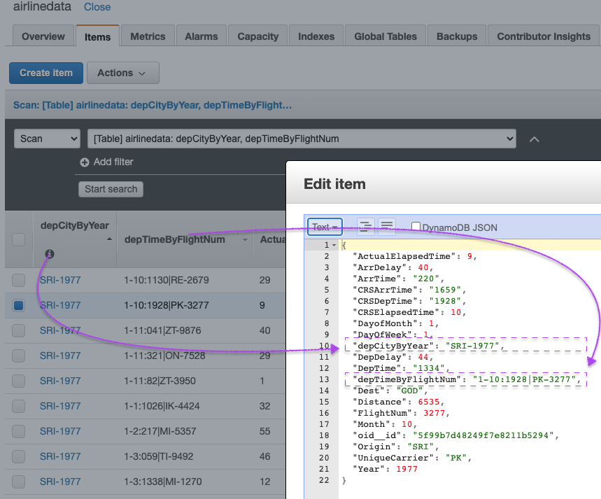

# Migrate your MongoDB to DynamoDB

Mystique Unicorn App backend is hosted on mongodb. Recenly one of their devs discovered that AWS released Amazon DynamoDB a key-value and document database that delivers single-digit millisecond performance at any scale. It's a fully managed, multiregion, multimaster, durable database with built-in security, backup and restore, and in-memory caching for internet-scale applications.

They have multiple collections `customers`, `loyalty` & `airlines` in their `miztiik_db` database. They are looking to migrate the `airlines` collection only. In addition to that, they do **NOT** want all the fields to be migrated and use this opportunity to drop some fields.

Here is sample of the airline record. Of these fields, they want to drop `CancellationCode` & `Diverted` when moving to DynamoDB.

```json
{
  "_id": ObjectId('5db883bd6d2b61f5442d77bb')
  "Year": 2014,
  "Month": 5,
  "DayofMonth": 10,
  "DayOfWeek": 3,
  "DepTime": "2310",
  "CRSDepTime": "179",
  "ArrTime": "1710",
  "CRSArrTime": "245",
  "UniqueCarrier": "TI",
  "FlightNum": 8194,
  "ActualElapsedTime": 47,
  "CRSElapsedTime": 28,
  "ArrDelay": 50,
  "DepDelay": 45,
  "Origin": "EDI",
  "Dest": "LUX",
  "Distance": 6509,
  "CancellationCode": "PH7I6P6S",
  "Diverted": "True"
}
```

As DynamoDB is schema less and the recommended approach is to store the data in a way that is easier to query, they want your help in desigining a _Primary Key_ & _Sort Key_. The primary query pattern is to get a list of delayed flights by airport for a year, scheduled flight details, etc.

Can you help them migrate from mongodb to DynamoDB?

## 🎯 Solutions

We will follow an multi-stage process to accomplish our goal. We need the following components to get this right,

1. **Source Database - MySQLDB**
   - If in AWS: EC2 instance in a VPC, Security Group, SSH Keypair(Optional)
   - Some dummy data inside the database
1. **Destination Database - RDS MySQL DB**
   - Subnet Groups
   - VPC Security Groups
1. **Database Migration Service(DMS) - Replication Instance**
   - DMS IAM Roles
   - Endpoints
   - Database Migration Tasks


In this article, we will build an architecture, similar to the one shown above - A simple mongo instance running on EC2 _(You are welcome to use your own mongodb instead_). For target we will build a Amazon DynamoDB and use DMS to migrate the data.

In this Workshop you will practice how to migrate your MongoDB databases to Amazon DynamoDB using different strategies.

1.  ## 🧰 Prerequisites

    This demo, instructions, scripts and cloudformation template is designed to be run in `us-east-1`. With few modifications you can try it out in other regions as well(_Not covered here_).

    - 🛠 AWS CLI Installed & Configured - [Get help here](https://youtu.be/TPyyfmQte0U)
    - 🛠 AWS CDK Installed & Configured - [Get help here](https://www.youtube.com/watch?v=MKwxpszw0Rc)
    - 🛠 Python Packages, _Change the below commands to suit your OS, the following is written for amzn linux 2_
      - Python3 - `yum install -y python3`
      - Python Pip - `yum install -y python-pip`
      - Virtualenv - `pip3 install virtualenv`

    As there are a number of components that need to be setup, we will use a combination of Cloudformation(generated from CDK), CLI & GUI.

1.  ## ⚙️ Setting up the environment

    - Get the application code

      ```bash
      git clone https://github.com/miztiik/mongodb-to-dynamodb
      cd mongodb-to-dynamodb
      ```

1.  ## 🚀 Prepare the environment

    We will need cdk to be installed to make our deployments easier. Lets go ahead and install the necessary components.

    ```bash
    # If you DONT have cdk installed
    npm install -g aws-cdk

    # Make sure you in root directory
    python3 -m venv .env
    source .env/bin/activate
    pip3 install -r requirements.txt
    ```

    The very first time you deploy an AWS CDK app into an environment _(account/region)_, you’ll need to install a `bootstrap stack`, Otherwise just go ahead and deploy using `cdk deploy`.

    ```bash
    cdk bootstrap
    cdk ls
    # Follow on screen prompts
    ```

    You should see an output of the available stacks,

    ```bash
    vpc-stack
    database-migration-prerequisite-stack
    mongodb-on-ec2
    ```

1.  ## 🚀 Deploying the Source Database

    Let us walk through each of the stacks,

    - **Stack: vpc-stack**
      This stack will do the following,

      1. Create an custom VPC `miztiikMigrationVpc`(_We will use this VPC to host our source MongoDB, DynamoDB, DMS Replication Instance_)

      Initiate the deployment with the following command,

      ```bash
      cdk deploy vpc-stack
      ```

    - **Stack: database-migration-prerequisite-stack**
      This stack will do the following,

      1. MongoDB & DMS Security groups - (_created during the prerequisite stack_)
         - Port - `27017` _Accessible only from within the VPC_
      1. DMS IAM Roles - (This stack will **FAIL**, If these roles already exist in your account)
         - `AmazonDMSVPCManagementRole`
         - `AmazonDMSCloudWatchLogsRole`
         - Role `dms-dynamodb-role` to interact with DynamoDB Service
           - As this is a demo, I have given full permissions for Dynamo - Consider restricting the permissions for _production_ use.
      1. SSH KeyPair using a custom cfn resource
         - _This resource is currently not used. The intial idea was to use the SSH Keypair to administer the source mongodb on EC2. [SSM Session Manager](https://www.youtube.com/watch?v=-ASMtZBrx-k) does the same job admirably._

      Initiate the deployment with the following command,

      ```bash
      cdk deploy database-migration-prerequisite-stack
      ```

      After successful completion, take a look at all the resources and get yourself familiar with them. We will be using them in the future.

    - **Stack: `mongodb-on-ec2` Source Database - MySQLDB**
      This stack will do the following,

      1. Create an EC2 instance inside our custom VPC(_created during the prerequisite stack_)
      1. Attach security group with mongo port(`27017`) open to the **world** (_For any use-case other than sandbox testing, you might want to restrict it_)
      1. Instance IAM Role is configured to allow SSM Session Manager connections(_No more SSH key pairs_)
      1. Instance is bootstrapped using `user_data` script to install `Mongodb 4.x`
      1. Create user `mongodbadmin` & password (_We will need this later for inserts and DMS_)
      1. Creates a table `miztiik_db`(_Later we will add a collection `customers`, `loyalty` & `airlines`_)
         - We will _only_ use the `airlines` collection for our migration

      Initiate the deployment with the following command,

      ```bash
      cdk deploy mongodb-on-ec2
      ```

      As our database is a fresh installation, it does not have any data in it. We need some data to migrate. This git repo also includes a `insert_records_to_mongodb.py` that will help us to generate some dummy data and insert them to the database. After successful launch of the stack,

      - Connect to the EC2 instance using SSM Session Manager - [Get help here](https://www.youtube.com/watch?v=-ASMtZBrx-k)
      - Switch to privileged user using `sudo su`
      - Navigate to `/var/log`
      - Run the following commands
        ```bash
        cd /var/log
        git clone https://github.com/miztiik/mongodb-to-dynamodb
        cd mongodb-to-dynamodb/mongodb_to_dynamodb/stacks/back_end/bootstrap_scripts
        python3 insert_records_to_mongodb.py
        ```
      - You should be able to see a summary at the end,
        _Expected Output_,

        ```json
        [root@ip-10-10-0-195 ~]# python3 insert_records_to_mongodb.py
        {"begin_record_insertion":"customers"}
        {"no_of_records_inserted":6}
        {"total_customers_coll_count":190}
        {"total_loyalty_coll_count":190}
        {"begin_record_insertion":"airlines"}
        {"records_inserted":1000}
        . . .
        {"no_of_records_inserted":4874}
        {"total_airlines_coll_count":333809}
        ```

        If you want to interact with mongodb, you can try out the following commands,

        ```bash
        # Open Mongo shell
        mongo
        # List all Database
        show dbs
        # Use one of the datbases
        use miztiik_db
        db.stats()
        # List all collections
        show collections
        # List some documents in the customer collection
        db.airlines.find()
        # List indexes
        db.airlines.getIndexes()
        # Quit
        quit()
        ```

        Now we are all done with our source database.

1.  ## 🚀 Deploying the Target Database - DynamoDB

    We can automate the creation of DynamoDB & DMS using CDK, But since this will be the first time we use these services,let us use the Console/GUI to set them up. We can leverage the excellant [documentation from AWS](https://docs.aws.amazon.com/amazondynamodb/latest/developerguide/getting-started-step-1.html) on how to setup our DynamoDB.

    Couple of things to note: Based on the example query patterns described by Miztiik Crop, We will use a composite primary key for the target DynamoDB table. Use a composite **primary key** with a partition key that is a combination of the same fields as in the MongoDB shard key (the `Origin` and `Year` attributes), and a **sort key** that is a combination of the `DayofMonth` (day of travel), `Month`, `CRSDepTime` (scheduled departure time), `UniqueCarrier` and `FlightNum` attributes.

    - Name your table as `airlinedata` - We will use this later in DMS task
    - For _Primary Key_: Choose type `String` with value `depCityByYear`
    - For _Sort Key_: Choose type `String` with value `depTimeByFlightNum`
    - Set your Write/READ capacity units(WCU & RCUs) at a level your application needs.

    **NOTE**: DMS can also create the dynamodb table for you, but it will set the WCU and RCU at `200`. This is the default, you can customize it.

1.  ## 🚀 Deploying the DMS Replication Instance

    We can leverage the excellant [documentation from AWS](https://docs.aws.amazon.com/dms/latest/userguide/CHAP_GettingStarted.html) on how to setup our DMS Replication Instance.

    Couple of things to note,

    - For VPC - Use our custom VPC `miztiikMigrationVpc`
    - For Security Group - Use `dms_sg_database-migration-prerequisite-stack`

    After creating the replication instance, We need to create few more resources to begin our replication. We will use defaults mostly

    - **Endpoints for source MongoDB**(_custom values listed below_)
      - Source choose mongodb
      - For server address se the private dns of the ec2 instance
      - Auth Mode should be `password`
      - Update user as `mongodbadmin`, the password `Som3thingSh0uldBe1nVault`
      - Authentication source as `admin`
      - Database name `miztiik_db`
      - **NOTE - Metadata mode: `table`**
      - Number of documents to scan - `1000`
      - Choose our custom VPC `miztiikMigrationVpc` and choose the DMS Replication instance we create in the previous step
    - **Endpoint for destination databases - DynamodbDB**(_custom values listed below_)
      - Choose `DynamoDB` as target
      - Add the `dms-dynamodb-role` role ARN created by **Stack: database-migration-prerequisite-stack**. You can also find the ARN in the ouputs section of the stack.
      - Ensure you choose SSL verification `verify-full` and upload CA certificate for the Amazon DocumentDB public key we downloaded earlier
      - Choose our custom VPC `miztiikMigrationVpc` and choose the DMS Replication instance we create in the previous step
    - **Database Migration Task**
      - Choose our replication instance, source & destination endpoints
      - For Target table preparation mode, choose `Do nothing` so that existing data and metadata of the target DynamoDB table are not affected. If the target DynamoDB table does not exist, the migration task creates a new table; otherwise, it appends data to an existing table
      - For Migration Type, choose `Migrate Existing Data and replicate ongoing changes`
      - Enable `CloudWatch Logs`
      - For Table Mappings, Select **JSON editor**
        - Use the file `dms_mongo_to_dynamob_table_mapping_rules.json` contents and paste it there.(_Sample shown below_)
        - We will use the table mapping feature to create _composite primary key_ with a partition key that is a combination of the same fields as in the MongoDB (the `Origin` and `Year` attributes), and a _sort key_ that is a combination of the `DayofMonth` (day of travel), `Month`, `CRSDepTime` (scheduled departure time), `UniqueCarrier` and `FlightNum` attributes. You can read more about table mapping here[6]
        - We will also drop (_exlcude_ two fields `CancellationCode` & `Diverted`)
        ```json
        {
          "rules": [
            {
              "rule-type": "selection",
              "rule-id": "1",
              "rule-name": "1",
              "object-locator": {
                "schema-name": "miztiik_db",
                "table-name": "airlines"
              },
              "rule-action": "include"
            },
            {
              "rule-type": "object-mapping",
              "rule-id": "2",
              "rule-name": "2",
              "rule-action": "map-record-to-record",
              "object-locator": {
                "schema-name": "miztiik_db",
                "table-name": "airlines"
              },
              "target-table-name": "airlinedata",
              "mapping-parameters": {
                "partition-key-name": "depCityByYear",
                "sort-key-name": "depTimeByFlightNum",
                "exclude-columns": ["CancellationCode", "Diverted"],
                "attribute-mappings": [
                  {
                    "target-attribute-name": "depCityByYear",
                    "attribute-type": "scalar",
                    "attribute-sub-type": "string",
                    "value": "${Origin}-${Year}"
                  },
                  {
                    "target-attribute-name": "depTimeByFlightNum",
                    "attribute-type": "scalar",
                    "attribute-sub-type": "string",
                    "value": "${DayofMonth}-${Month}:${CRSDepTime}|${UniqueCarrier}-${FlightNum}"
                  }
                ]
              }
            }
          ]
        }
        ```
      - Create Task

1.  ## 🔬 Testing the solution

    Navigate to DMS task, under `Table Statistics` You should be able observe that the dms has copied the data from source to target database. You can connect to RDS MySQL DB and test the records using the same commands that we used with source earlier.

    The `insert_records_to_mongodb.py` is available to you, you can modify it to make additional inserts, upserts, deletes etc., and observe if DMS CDC capture those changes correctly. Here is a snapshot of the status after deleting records where `Dest` is `LUX` in mongodb and some inserts were made.

    ```bash
    cd /var/log/mongodb-to-dynamodb/mongodb_to_dynamodb/stacks/back_end/bootstrap_scripts
    python3 insert_records_to_mongodb.py
    mongo
    use miztiik_db;
    try {
      db.airlines.deleteMany( { "Dest" : "LUX" } );
    } catch (e) {
      print (e);
    }
    ```

    

    In DynamoDB you can check the items,
    

    _Additional Learnings:_ You can check the logs in cloudwatch for more information or increase the logging level of the database migration task.

1.  ## 🔬 Testing the solution

    Navigate to DMS task, under `Table Statistics` You should be able observe that the dms has copied the data from mongodb to dynamodb. You can connect to dynamodb and test the records using the same commands that we used with mongodb earlier.

    _Additional Learnings:_ You can check the logs in cloudwatch for more information or increase the logging level of the database migration task.

1.  ## 📒 Conclusion

    Here we have demonstrated how to use Amazon Database Migration Service(DMS) to migrate data from MongoDB to DocumentDB.

1.  ## 🎯 Additional Exercises

    - Explore how you can migrate sharded mongodb clusters
    - or Check how you can add a validation step to the migration process, as it not supported natively(as on Q4 2020)

1)  ## 🧹 CleanUp

    If you want to destroy all the resources created by the stack, Execute the below command to delete the stack, or _you can delete the stack from console as well_

    - Resources created during [Deploying The Application](#deploying-the-application)
    - Delete CloudWatch Lambda LogGroups
    - _Any other custom resources, you have created for this demo_

    ```bash
    # Delete from cdk
    cdk destroy

    # Follow any on-screen prompts

    # Delete the CF Stack, If you used cloudformation to deploy the stack.
    aws cloudformation delete-stack \
        --stack-name "MiztiikAutomationStack" \
        --region "${AWS_REGION}"
    ```

    This is not an exhaustive list, please carry out other necessary steps as maybe applicable to your needs.

## 📌 Who is using this

This repository aims to teach api best practices to new developers, Solution Architects & Ops Engineers in AWS. Based on that knowledge these Udemy [course #1][103], [course #2][102] helps you build complete architecture in AWS.

### 💡 Help/Suggestions or 🐛 Bugs

Thank you for your interest in contributing to our project. Whether it's a bug report, new feature, correction, or additional documentation or solutions, we greatly value feedback and contributions from our community. [Start here][200]

### 👋 Buy me a coffee

[](https://ko-fi.com/Q5Q41QDGK) Buy me a [coffee ☕][900].

### 📚 References

1. [Setup MongoDB Community Edition on EC2][1]

1. [Create Database in MongoDB][2]

1. [Create Index in Mongodb][3]

1. [Setup MongoDB for public access][4]

1. [AWS Docs][5]

1. [Pymongo Insert][6]

### 🏷️ Metadata

**Level**: 300


[1]: https://docs.mongodb.com/manual/tutorial/install-mongodb-on-amazon/
[2]: https://www.mongodb.com/basics/create-database
[3]: https://www.guru99.com/working-mongodb-indexes.html
[4]: https://ianlondon.github.io/blog/mongodb-auth/
[5]: https://aws.amazon.com/blogs/database/performing-a-live-migration-from-a-mongodb-cluster-to-amazon-dynamodb/
[6]: https://docs.aws.amazon.com/dms/latest/userguide/CHAP_Target.DynamoDB.html
[100]: https://www.udemy.com/course/aws-cloud-security/?referralCode=B7F1B6C78B45ADAF77A9
[101]: https://www.udemy.com/course/aws-cloud-security-proactive-way/?referralCode=71DC542AD4481309A441
[102]: https://www.udemy.com/course/aws-cloud-development-kit-from-beginner-to-professional/?referralCode=E15D7FB64E417C547579
[103]: https://www.udemy.com/course/aws-cloudformation-basics?referralCode=93AD3B1530BC871093D6
[200]: https://github.com/miztiik/api-with-stage-variables/issues
[899]: https://www.udemy.com/user/n-kumar/
[900]: https://ko-fi.com/miztiik
[901]: https://ko-fi.com/Q5Q41QDGK
